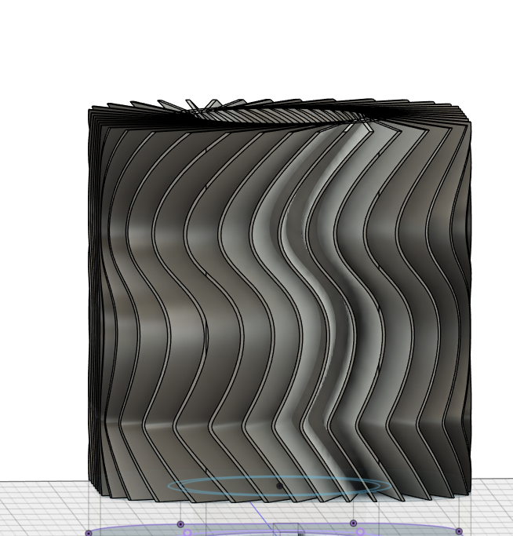
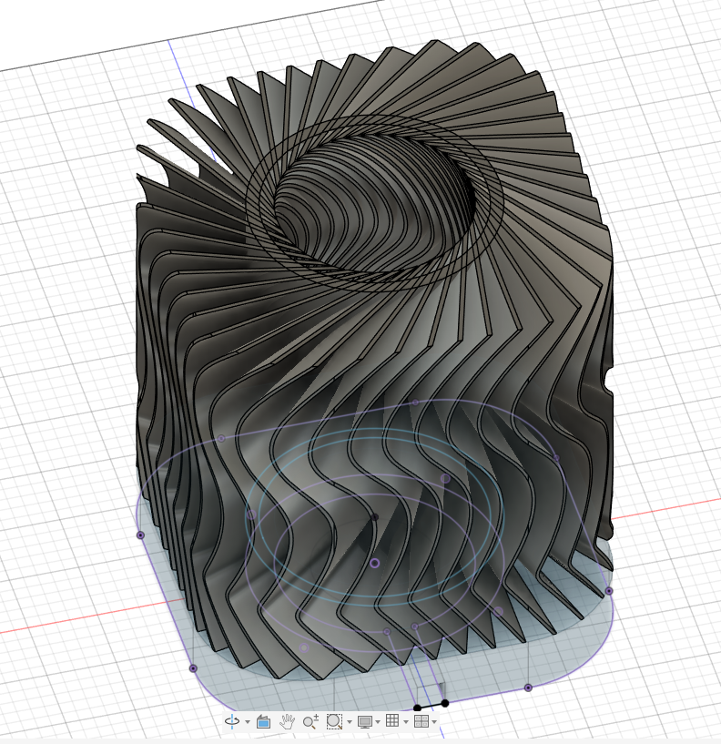
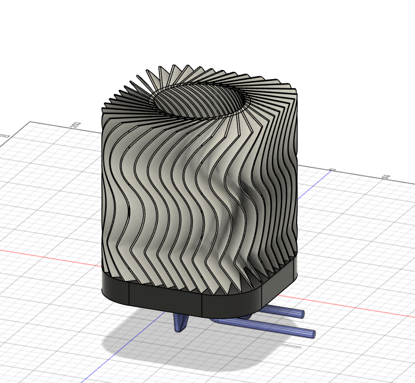
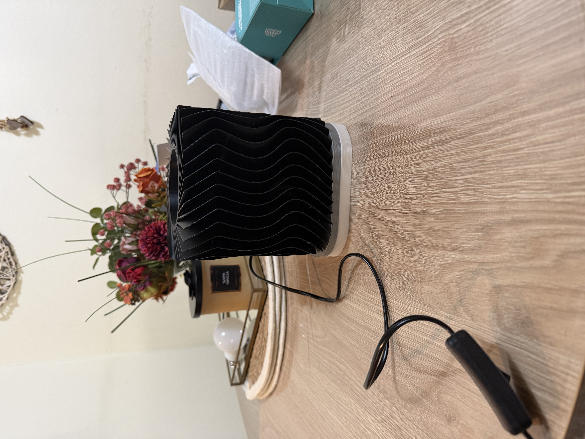

# cucu’s lamp

## Description

This is a project I've wanted to do for a long time. I've always loved 3D design, but I'd never sculpted anything before. In this project, I set out to build a lamp by repeating a circular pattern. A smart lamp that, in addition to showcasing my artistic skills, also highlights my design abilities. I did this project because I was motivated by the idea of ​​learning by creating something useful that I would use every day!

I did this project because I wanted to challenge myself and try modeling something with an "unusual" shape while learning to use different tools in Fusion (which I managed to do! :)).

To carry out the project, I watched a series of tutorials to learn how to use the tools. Once I had the knowledge, I started designing a lamp with the pattern I liked best. And this is the result!

## Result
Here it is the final result!

## BOM

| NAME      | AMOUNT | LINK |
|-----------|--------|------|
| E27 Cable | 1      | https://es.aliexpress.com/item/1005008137632596.html |
| E27 Bulb  | 1      | https://www.amazon.es/TP-Link-TAPO-L520E-Inteligente-Compatible/dp/B09KRVN7XG |
| 3D Parts  | 1 set  | — |

